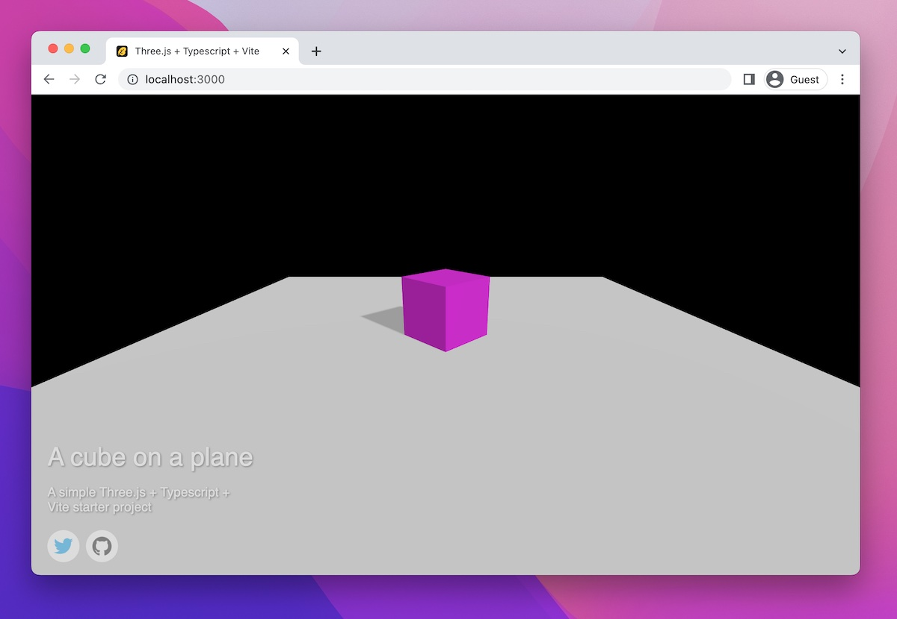

# Simple Three.js + TypeScript + Vite Starter

This scaffolding lets you easily get started with using Three.js and TypeScript.



## Features

- Vite development environment
- Full TypeScript support
- Asset management
- Debugging GUI and Stats
- Social media and description overlay
- Simple loading animation

## Prerequisites

- [Node.js](https://nodejs.org)
- [yarn](https://yarnpkg.com) OR [npm](https://www.npmjs.com)

> 💡 This project uses **yarn@3.2.1** and **npm@8.1.2**. Other versions might lead to different package resolutions, proceed with caution. Example commands use **yarn**.

## Installation

To use this scaffolding, run the following command:

```bash
git clone https://github.com/mayacoda/simple-threejs-typescript-starter my-threejs-project
cd my-threejs-project
yarn install
```

> ✅ If you are on GitHub, create a new repository using this repository as a template by clicking the green **Use this template** button in the top right.

## Development

The starter includes a pre-configured Vite server which you can use to run and develop your project. To start the development server, run the following command:

```bash
yarn dev
```

To build the project, run:

```bash
yarn build
```

And if you wish to automatically start a server to preview your build, you can run:

```bash
yarn build && yarn preview
```

### Engine

The starter includes a utility `Engine` class which is responsible for setting up the renderer, render loop, scene, camera, and controls. All you have to do is provide a class that follows the `Experience` interface and pass it to the `Engine` constructor.

```typescript
// in src/main.ts

import { Engine } from './engine/Engine'
import { Demo } from './demo/Demo'

new Engine({
  canvas: document.querySelector('#canvas') as HTMLCanvasElement,
  experience: Demo,
  info: {
    twitter: 'https://twitter.com/maya_ndljk',
    github: 'https://github.com/mayacoda/simple-threejs-typescript-starter',
    description: 'A simple Three.js + Typescript + Vite starter project',
    documentTitle: 'Three.js + Typescript + Vite',
    title: 'A cube on a plane',
  },
})
```

Then inside the class which implements `Experience`, you have access to the entire engine and its components.

```typescript
// in src/demo/Demo.ts

import { Engine } from '../engine/Engine'
import { Experience } from '../engine/Experience'
import { Resource } from '../engine/Resources'

export class Demo implements Experience {
  // list of resources required by the experience
  resources: Resource[] = []

  constructor(private engine: Engine) {}

  // initialize scene -- called by tne Engine after resources are loaded
  init() {}

  // called on resize
  resize() {}

  // called on each render
  update() {}
}
```

### Removing the example scene

To demonstrate how to use the scaffolding, this project includes an example scene. To remove it and start with a blank project, run:

```bash
yarn cleanup
```

This will also clear the content of this README.md file to just the basic commands for running the project.

### Serving Resources

Resources loaded through THREE.js loaders need to go in the `/public` directory to avoid being compiled by Vite. This includes textures and models.

Shaders are loaded using the [vite-plugin-glsl](https://github.com/UstymUkhman/vite-plugin-glsl) Vite plugin and can be located anywhere within the `/src` directory.

More information about Vite's asset handling can be found [here](https://vitejs.dev/guide/assets.html).
